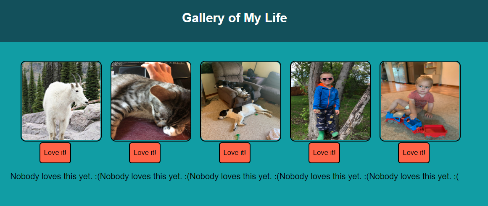
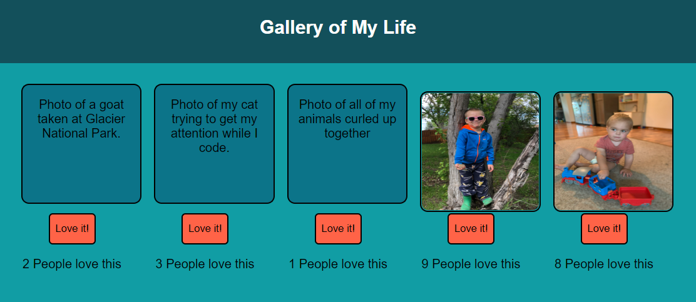

    

# Weekend React Gallery

## Table of Contents

- [Description](#description)
- [Screenshots](#screenshots)
- [Built With](#built-with)
- [Getting Started](#getting-started)
  - [Prerequisites](#prerequisites)
  - [Installation](#installation)
- [Usage](#usage)
- [License](#license)
- [Acknowledgements](#acknowledgements)
- [Contacts](#contacts)

## Description

For this project I created a gallery page to share pictures of things that are important to me. Visitors can click on an image to see a description and use a button to "love" an image.

## Screenshots

## Built With

## Getting Started

Make sure to 'npm install'. Then run the command, 'npm run client' and 'npm run server' in your code editor's terminal.

### Prerequisites

None

### Installation

npm install.

## Usage

1. You can click on an image to see the description of that image.
2. You can click the 'Love it!' button to increment an individual photo's counter.
3. If you click the button on one that hasn't been liked yet, it will change from 'Nobody loves this yet. :(' to one with a counter and 'People love this'.

## License

<a href="https://choosealicense.com/licenses/mit/">MIT License</a>

## Acknowledgements

Thanks to Prime Digital Academy who equipped and helped me to make this application a reality. Thanks to my instructor, Liz. Also, my undying thanks and gratitude to my classmates in the Jemisin cohort for their generosity and support.

## Contacts

 
